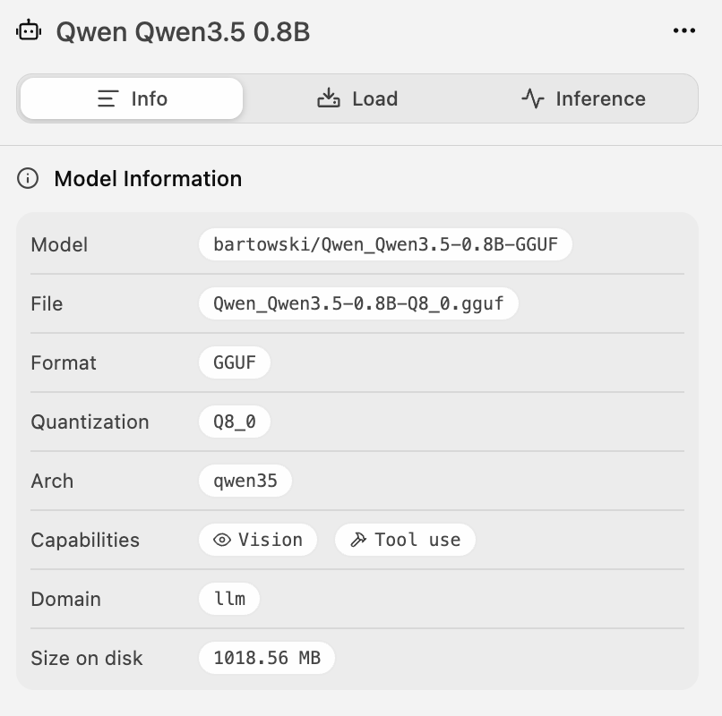
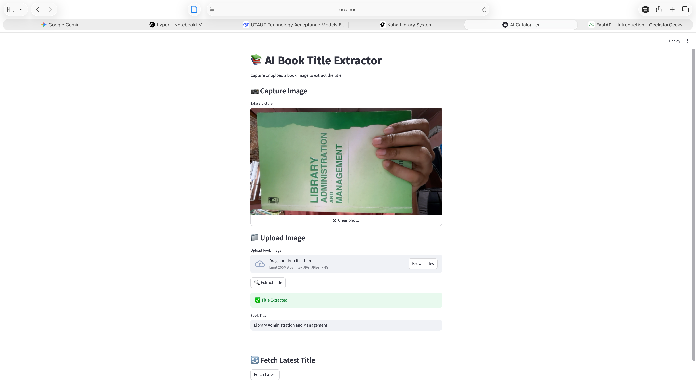
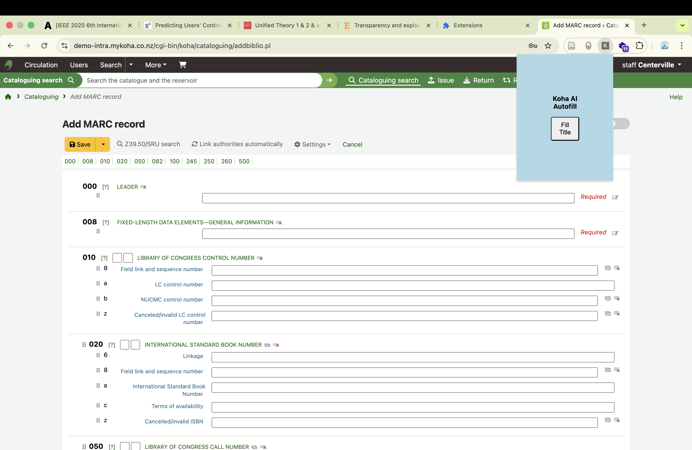

# Automating Cataloguing Workflow

An intelligent automated cataloguing system for libraries using **Qwen Vision** (LLM) and **Streamlit**. This tool significantly speeds up the book cataloguing process by extracting metadata directly from book covers using the camera and auto-filling it into **Koha** (ILS).

---

## 🎯 Overview

This project automates the metadata extraction and cataloguing workflow for libraries using Koha. 

Users can:
- Open their PC camera through a Streamlit web interface
- Capture multiple images of a book (front cover, spine, back, etc.)
- Process the images using **Qwen Vision Model** to extract accurate metadata
- Send the extracted data to a **browser extension**
- Auto-fill the cataloguing form in Koha with one click

---

## ✨ Features

- **Real-time Camera Capture**: Capture multiple photos of books directly from the browser
- **AI-Powered Metadata Extraction**: Uses **Qwen Vision** model for high-accuracy text and metadata extraction
- **Koha Integration**: Browser extension that seamlessly fills cataloguing fields in Koha
- **Streamlit Frontend**: Clean and user-friendly web interface
- **Multi-angle Support**: Supports front cover, spine, and back cover images for better accuracy

---

## 🛠️ Tech Stack

- **Backend/AI**: Qwen Vision Model (via API)
- **Frontend**: Streamlit (Python)
- **Browser Extension**: Chrome/Firefox Extension (for Koha integration)
- **Language**: Python

---

## 🚀 How It Works

1. Open the Streamlit application
2. Click on "Open Camera" to start capturing book images
3. Take multiple photos from different angles
4. Click **Process Images** → Qwen Vision model analyzes the images
5. Extracted metadata (Title, Author, ISBN, Publisher, Year, etc.) is displayed
6. Click **Send to Extension**
7. Go to Koha Cataloguing module → Click the browser extension icon
8. All fields are automatically filled

---

## 📸 Screenshots

*(Add screenshots here once you upload them)*

- Model Specifications
<p align="center">
  
</p>


- Camera Capture Screen
<p align="center">
  
</p>

- Koha Auto-fill in Action

<p align="center">
  
</p>

---

## 📁 Repository Structure
```
Automating-Cataloguing-Workflow/
├── app.py                  # Streamlit main application
├── extension/              # Browser extension files
├── utils/                  # Helper functions and Qwen API calls
├── requirements.txt
├── README.md
└── ...
```


---

## 🛠️ Setup & Installation

1. Clone the repository:
```bash
git clone https://github.com/Hungryfoxz/Automating-Cataloguing-Workflow.git
cd Automating-Cataloguing-Workflow
```
2. Install dependencies:
```bash
pip install -r requirements.txt
```

3. Set up your Qwen API key (in `.env` or config file)
4. Run the Streamlit app:
```bash
streamlit run app.py
```
5. Load the browser extension in Chrome/Firefox (Developer mode)

### 📌 Future Improvements

+ Support for more vision models (GPT-4o, Claude-3, etc.)
+ Batch processing capability
+ Barcode/QR code scanning
+ Export to MARC format
+ Docker support

### 🤝 Contributing
Contributions are welcome! Feel free to open issues or submit pull requests.

### 📄 License
This project is licensed under the MIT License.


